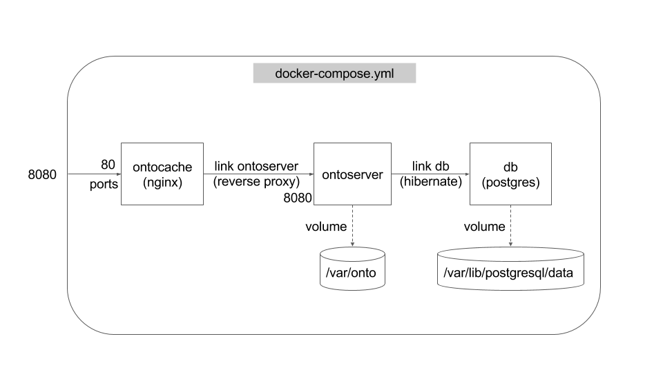

# Example Ontoserver deployment with horizontal scaling

This project provides an example deployment approach for readonly horizontal scaling of [Ontoserver](https://ontoserver.csiro.au).
It uses an NGINX cache and is based on the default Ontoserver deployment described at https://ontoserver.csiro.au/docs/.

It uses Docker Swarm as the scaling mechanism.
For background see [Services](https://docs.docker.com/get-started/part3/), [Swarms](https://docs.docker.com/get-started/part4/), and [Stacks](https://docs.docker.com/get-started/part5/).

The stack defined in the docker-compose file (`docker-compose.yml`) looks like this:



To add HTTPS support:
 * Add your fullchain and private key files to ontocache/conf/certs/
 * Edit ontocache/conf/snippets/ssl-your.domain.here.conf (and if you rename the file, make sure you fix /ontocache/conf/nginx.conf to match)
 * Edit docker-compose to expose the cache's port 443 as 8443 instead of port 80 as 8080

You will also need to edit the `docker-compose.yml` file to set appropriate values for `ontoserver.fhir.base` and `ontoserver.synd.base`.
They are currently pointing at `localhost` which is suitable for a local test deployment, but should be updated to reference the proper endpoint for your service.
Remember to also change the `http:` to `https:` if you are using TLS as well as specifying the correct port if other than the defaults (80 for http and 443 for https).

# Deploying the stack and scaling up

To [deploy the stack](https://docs.docker.com/engine/swarm/stack-deploy/) you'll need a Docker Engine (v 1.13.0 or greater) running in [swarm mode](https://docs.docker.com/engine/swarm/swarm-mode/).

You will also need a Docker registry to distribute the images to the swarm:

`$` `docker service create --name registry --publish published=5000,target=5000 registry:2`

Then build and push local images:

`$` `docker-compose build`
```
db uses an image, skipping
stateful uses an image, skipping
stateless uses an image, skipping
Building cache
Step 1/4 : FROM nginx:alpine
 ---> 0ae090dba3ab
Step 2/4 : RUN mkdir /var/nginx
 ---> Using cache
 ---> 0ee4c368c6f5
Step 3/4 : COPY conf/ /etc/nginx/
 ---> Using cache
 ---> 8b5a16a581c2
Step 4/4 : COPY certs/ /certs/
 ---> Using cache
 ---> f6ea67e920c1
Successfully built f6ea67e920c1
Successfully tagged 127.0.0.1:5000/ontocache:latest
```

`$` `docker-compose push`
```
Pushing cache (127.0.0.1:5000/ontocache:latest)...
The push refers to repository [127.0.0.1:5000/ontocache]
ab2a82857b75: Pushed
45fff54c1a47: Pushed
f136cfe029a4: Pushed
4a8d9a67e458: Pushed
c0ab80890b7f: Pushed
d4930e247b49: Pushed
9f8566ee5135: Pushed
latest: digest: sha256:f4f81af304eabfe1007c0709e4cb949576c2da25cb37b14afbe642729cb0e71d size: 1776
```

Now you can deploy the stack:

`$` `docker stack deploy --compose-file docker-compose.yml onto`
```
Ignoring unsupported options: build

Creating network onto_default
Creating service onto_cache
Creating service onto_stateful
Creating service onto_stateless
Creating service onto_db
```

To scale up the number of servers:

`$` `docker service scale onto_stateless=5`
```
onto_stateless scaled to 5
overall progress: 5 out of 5 tasks 
1/5: running   [==================================================>] 
2/5: running   [==================================================>] 
3/5: running   [==================================================>] 
4/5: running   [==================================================>] 
5/5: running   [==================================================>] 
verify: Service converged 
```

And to scale back down again:

`$` `docker service scale onto_stateless=1`
```
onto_stateless scaled to 1
overall progress: 1 out of 1 tasks 
1/1: running   [==================================================>] 
verify: Service converged 
```


# How does it work?

This deployment runs one stateful Ontoserver instance and zero or more instances of Ontoserver, all in a **read only** mode.

The stateless instances provide the horizontal scaling.  The Nginx cache is configured to route the requests to the appropriate instances, and can provide TLS if required.

The stateful instance is there to support _write_ operations as well as _read only_ interactions that nevertheless intrinsically establish state in the instance.
Rather than introduce the need for _sticky routing_ so that subsequent related requests go to the same instance, a single instance is used for all of these kinds of requests.

The first two of the stateful operations are `_search` and `_history` -- due to the way paging is specified in FHIR, the URLs for the previous and next page of results are specific to the instance that generated the current result page.

The third stateful operation is `$closure` -- this is because it creates a notion of shared or synchronised state between the client and the server.

For most deployments one could expect that both `_search` and `_history` have a relatively low-volume of requests, are not response-time critical, and thus can be served by a single instance.
Things are slightly different for `$closure` -- it is not yet a commonly used operation, but it would not be surprising that if it were used, then it might get a high-volume of requests.
In this case, scaling can be done using the stateless instances by using the `name` parameter as a _sharding key_ such that all `$closure` requests with the same value for `name` are routed to the same stateless instance.

Note also that because Ontoserver only supports a select set of operations in a `batch` request, it can be handled by the stateless instances.

